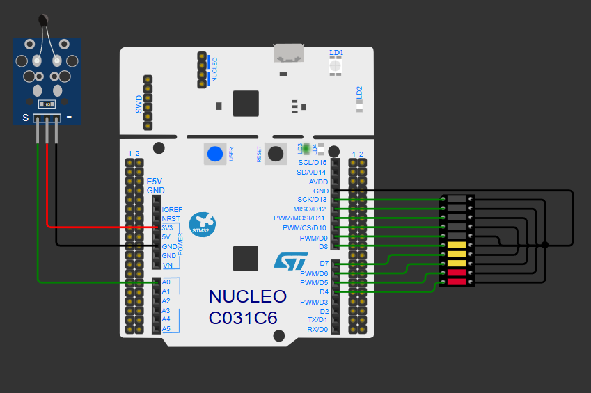
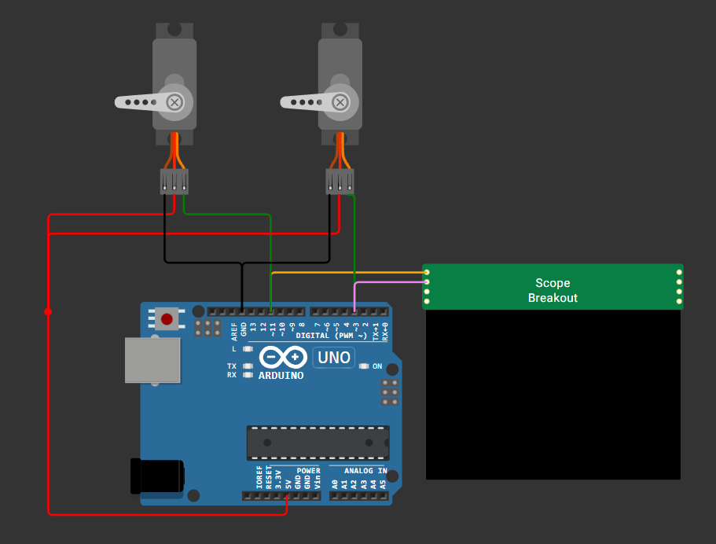
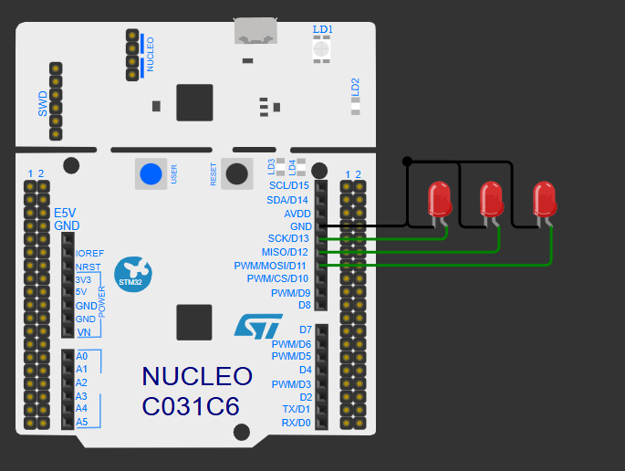

# IITM Embedded Systems Projects

A collection of embedded-systems projects developed using Arduino, the ATmega328P, and STM32 microcontrollers. The projects explore GPIO control, non-blocking timing, interrupts, timer configuration, PWM generation, and sensor interfacing through browser-based [Wokwi](https://wokwi.com/) simulations.

## Project Overview

| Project | Platform | Key concepts | Simulation |
|---|---|---|---|
| [Traffic Light Controller](#1-traffic-light-controller) | Arduino | GPIO, sequential control, timing | [Run on Wokwi](https://wokwi.com/projects/470977755490312193) |
| [4-Bit Binary LED Counter](#2-4-bit-binary-led-counter) | Arduino | Non-blocking timing, `millis()` | [Run on Wokwi](https://wokwi.com/projects/470977327677496321) |
| [Temperature LED Bar Graph](#3-temperature-led-bar-graph) | Arduino | ADC, NTC sensing, data quantization | [Run on Wokwi](https://wokwi.com/projects/470977443880716289) |
| [RGB LED Controller](#4-rgb-led-controller) | Arduino | User input, debouncing, state control | [Run on Wokwi](https://wokwi.com/projects/470977911618067457) |
| [ATmega328P Timer in CTC Mode](#5-atmega328p-timer-in-ctc-mode) | ATmega328P | Timer2, CTC mode, prescaling, ISR | [Run on Wokwi](https://wokwi.com/projects/470977584687719425) |
| [Dual-Servo Control using Timer2](#6-dual-servo-control-using-timer2) | ATmega328P | Phase-correct PWM, pulse-width mapping | [Run on Wokwi](https://wokwi.com/projects/470977075489677313) |
| [Three-LED STM32 GPIO Control](#7-three-led-stm32-gpio-control) | STM32 Nucleo | GPIO configuration, STM32 workflow | [Run on Wokwi](https://wokwi.com/projects/437282800203949057) |

## Projects

### 1. Traffic Light Controller

Implements a continuously repeating traffic-light sequence using three digital outputs. The green, yellow, and red LEDs are activated for 1 s, 0.2 s, and 1 s, respectively.

- **Concepts:** Digital GPIO and sequential timing
- **Pins:** Green D13, yellow D12, red D11
- **Project files:** [Download the project archive](./Traffic%20Light%20LEDs%20-%20Arduino%20-%20Template.zip)
- **Simulation:** [Run on Wokwi](https://wokwi.com/projects/402288038898644993)

### 2. 4-Bit Binary LED Counter

Creates a four-bit LED counter with a complete 16-second cycle. Each LED toggles independently using `millis()`, allowing the program to operate without blocking delay calls.

- **Concepts:** Non-blocking timing and concurrent output control
- **Pins:** D13 to D10, representing the most significant to least significant bit
- **Project files:** [Download the project archive](./4-bit%20Binary%20LED%20-%20Template.zip)
- **Simulation:** [Run on Wokwi](https://wokwi.com/projects/402325228669071361)

### 3. Temperature LED Bar Graph

Reads an NTC thermistor through the ADC, converts the measured value to temperature, and represents the result on a ten-LED bar graph. The display maps temperatures from −24 °C to 80 °C into ten discrete levels.

- **Concepts:** Analog acquisition, thermistor conversion, scaling, and quantization
- **Sensor input:** A0
- **LED outputs:** Pins D13
- **Project files:** [Download the project archive](./_Temperature%20LED%20Bargraph%20-%20Template.zip)
- **Simulation:** [Run on Wokwi](https://wokwi.com/projects/402372372370534401)

### 4. RGB LED Controller

Controls the colour and update interval of an RGB LED using two push-buttons. The program cycles through seven colours and five timing values while applying software debouncing and reporting the selected settings through the serial monitor.

- **Concepts:** Button interfacing, debouncing, state management, and serial output
- **RGB outputs:** D13, D12, and D11
- **Button inputs:** D6 and D7
- **Project files:** [Download the project archive](./RGB%20LED%20Color%20and%20Delay%20Change%20using%20Interrupts%20-%20Template.zip)
- **Simulation:** [Run on Wokwi](https://wokwi.com/projects/403450329010273281)

### 5. ATmega328P Timer in CTC Mode

Configures the ATmega328P Timer2 peripheral in Clear Timer on Compare Match (CTC) mode. With a 16 MHz clock, a 1024 prescaler, and `OCR2A = 124`, the timer produces 125 compare-match interrupts per second. The ISR toggles D12 on every interrupt and D13 after 125 interrupts.

- **Concepts:** Register-level AVR programming, timer prescaling, CTC mode, and interrupt service routines
- **Outputs:** D12 (`PB4`) and D13 (`PB5`)
- **Project files:** [Download the project archive](./Atmega%20Timers%20-%20CTC%20Mode%20with%20Prescaling%20-%20Template.zip)
- **Simulation:** [Run on Wokwi](https://wokwi.com/projects/413931819010252801)

### 6. Dual-Servo Control using Timer2

Generates PWM signals for two servo motors through the ATmega328P Timer2 outputs. Angle commands from 0° to 180° are mapped to servo pulse widths, enabling fixed-position tests and complementary sweep motion.

- **Concepts:** Phase-correct PWM, register-level timer control, value clipping, and range mapping
- **PWM outputs:** D11 (`OC2A`) and D3 (`OC2B`)
- **Project files:** [Download the project archive](./Servo%20control%20using%20Atmega%20Timers%20-%20Template.zip)
- **Simulation:** [Run on Wokwi](https://wokwi.com/projects/414015523297727489)

### 7. Three-LED STM32 GPIO Control

Demonstrates the STM32 project workflow by configuring three GPIO pins as digital outputs and toggling the connected LEDs simultaneously at one-second intervals.

- **Concepts:** STM32 GPIO configuration and multi-output control
- **Board:** STM32 Nucleo
- **Project files:** [Download the project archive](./BLINK-3LED_STMHAL.zip)
- **Simulation:** [Run on Wokwi](https://wokwi.com/projects/437282800203949057)

## Tools and Technologies

- **Languages:** Embedded C and Arduino C++
- **Microcontrollers:** ATmega328P and STM32
- **Simulation:** Wokwi
- **Configuration:** STM32CubeMX
- **Interfaces and peripherals:** GPIO, ADC, timers, PWM, and interrupts

## Running a Project

1. Select **Run on Wokwi** beside the required project.
2. Start the simulation using the green play button.
3. Interact with the virtual buttons, sensors, LEDs, or servos as applicable.
4. To inspect the source locally, download the corresponding archive and extract its contents.

Each archive contains the source code, `diagram.json`, project-specific documentation, and the original Wokwi project reference.

## Author

[Ashwin Shankar](https://github.com/shanks005)
